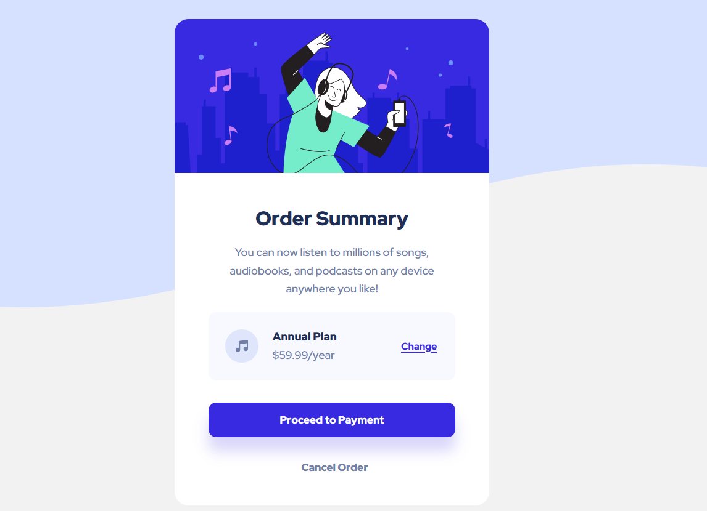

# order-summery-component

<h1>Frontend Mentor - NFT preview card component solution</h1>

<h3>Screenshot</h3>

<h3>Links</h3>
<a href="">Solution URL </a>
 
<a href=""> Live Site URL</a>

<h3>Built with</h3>

Semantic HTML5 markup

CSS custom properties

Flexbox

<h3>What I learned</h3>

 Responsive web design principles 

<h3>Author</h3>

Elene Gigauri

